# 🏗️ خطة تطوير مؤسسة الدكتور عمر هشام — الانطلاق الكامل

> تحليل شامل للمشروع وخطة تنفيذية مفصّلة لكل النواقص المطلوبة قبل الإطلاق

---

## 📊 الوضع الحالي — Current State

المشروع يملك **واجهة أمامية رائعة** بـ 16+ صفحة، نظام تصميم متكامل، و API backend مع Hono + Supabase. لكن هناك **ثغرات جوهرية** تمنع الإطلاق الفعلي:

| المنطقة | الحالة | التقييم |
|---|---|---|
| التصميم والـ UI | ✅ ممتاز | تصميم فاخر، responsive، RTL، إمكانية وصول |
| الـ CSS | ✅ شامل | 54KB، animations، design system متكامل |
| الصفحات | ✅ كل الصفحات موجودة | 16 صفحة + dashboard |
| الـ API Backend | ⚠️ هيكل فقط | Endpoints موجودة لكن بدون حماية |
| المصادقة (Auth) | ❌ مكسورة | JWT لا يُمرر لـ Supabase، RLS لا تعمل |
| أمان الـ Admin | ❌ خطير | أي شخص يقدر يحذف/يعدل البيانات |
| نماذج الإدخال | ❌ بدون validation | لا يوجد تحقق من المدخلات |
| الدفع | ❌ غير موجود | لا يوجد بوابة دفع |
| الصور | ❌ ناقصة | فقط 3 صور من أصل 30+ مطلوبة |
| لوحة التحكم | ❌ واجهة فقط | بيانات ثابتة، بدون CRUD |
| Dark Mode | ❌ معطّل | الكود موجود لكن معلّق |

---

## User Review Required

> [!CAUTION]
> **الـ Auth مكسورة بالكامل** — ملف `supabase.ts` يستخدم `anon key` فقط ولا يمرر JWT المستخدم لـ Supabase. هذا يعني إن كل سياسات RLS المبنية على `auth.uid()` **لا تعمل**. أي شخص يقدر يصل لأي endpoint بدون مصادقة.

> [!WARNING]
> **Admin APIs مكشوفة** — كل endpoints الإدارة (POST/PUT/DELETE) على campaigns, news, jobs, volunteers **ليس عليها أي middleware مصادقة**. أي شخص يقدر يحذف كل الحملات أو يضيف أخبار مزيفة.

> [!IMPORTANT]
> **بوابة الدفع** — الموقع يقبل تبرعات لكن **لا يوجد تكامل مع أي بوابة دفع** (Stripe, Fawry, PayPal). هل تفضل بوابة معينة؟

---

## Open Questions

> [!IMPORTANT]
> 1. **بوابة الدفع**: هل تريد Stripe (عالمي) أو Fawry/Paymob (مصري) أو كلاهما؟
> 2. **خدمة البريد الإلكتروني**: هل تريد Resend أو SendGrid أو Mailgun لإرسال إشعارات الإيميل؟
> 3. **صور الفريق والحملات**: هل عندك صور حقيقية ولا تحب أولّد صور AI مؤقتة؟
> 4. **الدومين**: هل عندك دومين جاهز للربط مع Cloudflare Pages؟
> 5. **Supabase**: هل المشروع على Supabase متوصل فعلاً ولا لسه؟ هل الـ schema اتطبق؟

---

## Proposed Changes

### Phase 1: 🔐 إصلاح الأمان الحرج (Critical Security) — الأولوية القصوى

> الموقع **لا يمكن إطلاقه** بدون هذه الإصلاحات

---

#### [MODIFY] [supabase.ts](file:///c:/Users/Metra/Desktop/omar-hesham-foundation/src/lib/supabase.ts)

**المشكلة**: الـ Supabase client يستخدم `anon key` فقط ولا يمرر JWT المستخدم.

**التغييرات**:
- إنشاء `createSupabaseClient(env)` — للعمليات العامة (anon)
- إنشاء `createSupabaseAdmin(env)` — باستخدام `SERVICE_ROLE_KEY` لعمليات الإدارة
- إنشاء `createSupabaseAuth(env, token)` — يمرر JWT المستخدم لتفعيل RLS

```typescript
// Public client (anon - respects RLS)
export const createSupabase = (env) => createClient(env.SUPABASE_URL, env.SUPABASE_ANON_KEY);

// Admin client (bypasses RLS)
export const createSupabaseAdmin = (env) => createClient(env.SUPABASE_URL, env.SUPABASE_SERVICE_ROLE_KEY);

// Authenticated client (user JWT - RLS works correctly)
export const createSupabaseAuth = (env, token) => createClient(env.SUPABASE_URL, env.SUPABASE_ANON_KEY, {
  global: { headers: { Authorization: `Bearer ${token}` } }
});
```

---

#### [NEW] [middleware.ts](file:///c:/Users/Metra/Desktop/omar-hesham-foundation/src/api/middleware.ts)

**إنشاء middleware للمصادقة والتحقق**:
- `authMiddleware` — يتحقق من Bearer token ويحقق صلاحية الجلسة
- `adminMiddleware` — يتحقق إن المستخدم admin
- `validateBody(schema)` — يتحقق من صحة المدخلات
- `rateLimiter` — حماية من الهجمات (باستخدام Cloudflare KV أو in-memory)

---

#### [MODIFY] كل ملفات الـ API في `src/api/`

**تطبيق الـ middleware على كل الـ routes المحمية**:

| ملف | التغيير |
|---|---|
| [campaigns.ts](file:///c:/Users/Metra/Desktop/omar-hesham-foundation/src/api/campaigns.ts) | إضافة `adminMiddleware` على POST/PUT/DELETE |
| [news.ts](file:///c:/Users/Metra/Desktop/omar-hesham-foundation/src/api/news.ts) | إضافة `adminMiddleware` على POST/PUT/DELETE |
| [jobs.ts](file:///c:/Users/Metra/Desktop/omar-hesham-foundation/src/api/jobs.ts) | إضافة `adminMiddleware` على POST + GET applications |
| [volunteers.ts](file:///c:/Users/Metra/Desktop/omar-hesham-foundation/src/api/volunteers.ts) | إضافة `adminMiddleware` على GET + PUT status |
| [contacts.ts](file:///c:/Users/Metra/Desktop/omar-hesham-foundation/src/api/contacts.ts) | إضافة `adminMiddleware` على GET |
| [newsletter.ts](file:///c:/Users/Metra/Desktop/omar-hesham-foundation/src/api/newsletter.ts) | إضافة `adminMiddleware` على GET subscribers |
| [donations.ts](file:///c:/Users/Metra/Desktop/omar-hesham-foundation/src/api/donations.ts) | إصلاح auth + إضافة `adminMiddleware` على stats |
| [profile.ts](file:///c:/Users/Metra/Desktop/omar-hesham-foundation/src/api/profile.ts) | إصلاح auth + إضافة PUT endpoint |
| [auth.ts](file:///c:/Users/Metra/Desktop/omar-hesham-foundation/src/api/auth.ts) | إضافة input validation + rate limiting |

---

#### [MODIFY] [index.ts](file:///c:/Users/Metra/Desktop/omar-hesham-foundation/src/api/index.ts)

- إضافة CORS middleware عام
- إضافة global error handler
- إضافة request logging

---

### Phase 2: ✅ تحقق المدخلات وربط النماذج (Input Validation & Form Connectivity)

---

#### [MODIFY] [app.js](file:///c:/Users/Metra/Desktop/omar-hesham-foundation/public/static/app.js)

**التغييرات الشاملة**:
1. **Client-side validation لكل النماذج**:
   - التبرع: التحقق من المبلغ (> 0)، الاسم، رقم الهاتف
   - التواصل: التحقق من الإيميل، الرسالة
   - التطوع: التحقق من كل الحقول المطلوبة
   - التوظيف: التحقق من البيانات + الـ CV
   - التسجيل: التحقق من قوة كلمة المرور

2. **حالات التحميل (Loading States)**:
   - عرض spinner على الأزرار أثناء الإرسال
   - تعطيل الزر لمنع الإرسال المتكرر

3. **عرض الأخطاء والنجاح**:
   - Toast notifications بدل `alert()`
   - رسائل نجاح مصمّمة

4. **إدارة حالة المصادقة**:
   - تحديث الـ navbar بعد تسجيل الدخول (إخفاء زر "دخول"، عرض اسم المستخدم)
   - حفظ الـ token في cookie + إرساله مع كل API call
   - Redirect بعد تسجيل الدخول
   - تفعيل زر تسجيل الخروج

5. **ربط newsletter في الـ footer بالـ API**

---

#### [NEW] [validators.ts](file:///c:/Users/Metra/Desktop/omar-hesham-foundation/src/lib/validators.ts)

**مكتبة validation خفيفة للـ backend**:
- `validateEmail(email)` — تحقق من صيغة الإيميل
- `validatePhone(phone)` — تحقق من رقم الهاتف المصري
- `validateRequired(fields)` — التحقق من الحقول المطلوبة
- `validateAmount(amount)` — التحقق من المبلغ (رقم موجب)
- `sanitizeInput(text)` — تنظيف المدخلات من HTML/XSS

---

### Phase 3: 🖼️ الصور والأصول البصرية (Image Assets & Visual Completion)

---

#### المطلوب توليده/إضافته:

| الصورة | الموقع | الوصف |
|---|---|---|
| `favicon.ico` + `favicon.svg` | `public/` | أيقونة الموقع من الشعار |
| `og-image.png` | `public/static/img/` | صورة للمشاركة على السوشيال ميديا |
| `campaign-health.jpg` | `public/static/img/` | صورة حملة صحية |
| `campaign-food.jpg` | `public/static/img/` | صورة حملة غذائية |
| `campaign-education.jpg` | `public/static/img/` | صورة حملة تعليمية |
| `campaign-shelter.jpg` | `public/static/img/` | صورة حملة إيواء |
| `campaign-orphans.jpg` | `public/static/img/` | صورة حملة أيتام |
| `event-1.jpg` to `event-3.jpg` | `public/static/img/` | صور فعاليات |
| `news-1.jpg` to `news-3.jpg` | `public/static/img/` | صور أخبار |
| `gallery-1.jpg` to `gallery-8.jpg` | `public/static/img/` | صور معرض |
| `team-1.jpg` to `team-4.jpg` | `public/static/img/` | صور فريق العمل |
| `story-1.jpg` to `story-3.jpg` | `public/static/img/` | صور قصص نجاح |
| `partner-1.svg` to `partner-5.svg` | `public/static/img/` | شعارات شركاء |
| `hero-bg.jpg` | `public/static/img/` | خلفية Hero احتياطية |
| `apple-touch-icon.png` | `public/` | أيقونة iOS |

> سيتم استخدام `generate_image` لتوليد صور AI مؤقتة عالية الجودة تناسب طابع المؤسسة الخيرية، ويمكنك استبدالها لاحقاً بصور حقيقية.

---

### Phase 4: 🎨 التحسينات البصرية (UI Polish & Missing Pages)

---

#### [NEW] [404.tsx](file:///c:/Users/Metra/Desktop/omar-hesham-foundation/src/pages/404.tsx)

**صفحة 404 مصمّمة**:
- تصميم فاخر يتناسب مع هوية الموقع
- رابط العودة للرئيسية
- اقتراحات صفحات

---

#### [MODIFY] [index.tsx](file:///c:/Users/Metra/Desktop/omar-hesham-foundation/src/index.tsx)

- إضافة route لصفحة 404 (catch-all `*`)
- إضافة error boundary handler
- إضافة per-page SEO meta tags (title, description, OG tags)

---

#### [MODIFY] [style.css](file:///c:/Users/Metra/Desktop/omar-hesham-foundation/public/static/style.css)

- **تفعيل Dark Mode**: إزالة التعليق عن `prefers-color-scheme: dark` وإكمال الألوان
- **إضافة Toast Notification styles**
- **إضافة Loading spinner styles**
- **إضافة 404 page styles**
- **إضافة form validation error styles** (حدود حمراء، رسائل خطأ)
- **تحسين print styles** للتقارير

---

#### [MODIFY] [layout.tsx](file:///c:/Users/Metra/Desktop/omar-hesham-foundation/src/layout.tsx)

- إصلاح الروابط الوهمية (`#` → المسارات الحقيقية)
- إصلاح روابط السوشيال ميديا
- تحديث سنة الحقوق (2025 → dynamic)
- إضافة favicon و meta tags
- إضافة Open Graph tags
- إضافة structured data (JSON-LD) للمؤسسة

---

### Phase 5: 📊 لوحة التحكم الكاملة (Admin Dashboard)

---

#### [MODIFY] [dashboard/index.tsx](file:///c:/Users/Metra/Desktop/omar-hesham-foundation/src/pages/dashboard/index.tsx)

**إعادة بناء لوحة التحكم بالكامل**:

1. **حماية الصفحة** — redirect لصفحة الدخول إذا المستخدم مش admin
2. **KPI Cards ديناميكية** — تسحب من `/api/donations/stats` و endpoints الأخرى
3. **جداول CRUD**:
   - إدارة الحملات (إضافة/تعديل/حذف)
   - إدارة الأخبار
   - إدارة الفعاليات
   - مراجعة طلبات التطوع (قبول/رفض)
   - مراجعة طلبات التوظيف
   - عرض رسائل التواصل (مقروءة/غير مقروءة)
   - عرض التبرعات
   - إدارة مشتركي النشرة البريدية
4. **Charts ديناميكية** — بيانات حقيقية من الـ API
5. **Modal forms** — نماذج إضافة/تعديل في modal

---

#### [MODIFY] API files — إضافة endpoints ناقصة

| ملف | Endpoint الجديد |
|---|---|
| [events.ts](file:///c:/Users/Metra/Desktop/omar-hesham-foundation/src/api/events.ts) | POST, PUT, DELETE (admin CRUD) |
| [stories.ts](file:///c:/Users/Metra/Desktop/omar-hesham-foundation/src/api/stories.ts) | POST, PUT, DELETE (admin CRUD) |
| [profile.ts](file:///c:/Users/Metra/Desktop/omar-hesham-foundation/src/api/profile.ts) | PUT (تعديل الملف الشخصي) |
| كل الـ list endpoints | إضافة pagination (`?page=1&limit=20`) |

---

### Phase 6: 🔗 التكاملات الخارجية (External Integrations)

---

#### [NEW] [payment.ts](file:///c:/Users/Metra/Desktop/omar-hesham-foundation/src/api/payment.ts)

**تكامل بوابة الدفع** (حسب اختيارك):
- إنشاء payment intent / session
- Webhook لتحديث حالة التبرع بعد الدفع
- صفحة نجاح/فشل الدفع

---

#### [NEW] [email.ts](file:///c:/Users/Metra/Desktop/omar-hesham-foundation/src/lib/email.ts)

**نظام إرسال الإيميلات**:
- ترحيب بالمستخدم الجديد
- تأكيد التبرع + إيصال
- إشعار Admin برسالة تواصل جديدة
- إشعار Admin بطلب تطوع جديد
- تأكيد اشتراك النشرة البريدية
- استعادة كلمة المرور

---

#### [MODIFY] [auth.ts](file:///c:/Users/Metra/Desktop/omar-hesham-foundation/src/api/auth.ts)

- إضافة endpoint **نسيت كلمة المرور** (`POST /api/auth/forgot-password`)
- إضافة endpoint **إعادة تعيين كلمة المرور** (`POST /api/auth/reset-password`)
- إضافة **تأكيد الإيميل** بعد التسجيل

---

### Phase 7: 🚀 تجهيز الإطلاق (Launch Readiness)

---

#### [MODIFY] [wrangler.jsonc](file:///c:/Users/Metra/Desktop/omar-hesham-foundation/wrangler.jsonc)

- تغيير اسم المشروع من `webapp` → `omar-hesham-foundation`
- إضافة environment variables bindings
- إضافة custom domain (إذا متوفر)

---

#### [NEW] [robots.txt](file:///c:/Users/Metra/Desktop/omar-hesham-foundation/public/robots.txt)

```
User-agent: *
Allow: /
Disallow: /dashboard
Disallow: /api/
Sitemap: https://omarhesham.org/sitemap.xml
```

---

#### [NEW] [sitemap.ts](file:///c:/Users/Metra/Desktop/omar-hesham-foundation/src/api/sitemap.ts)

- XML sitemap ديناميكي يشمل كل الصفحات
- يُحدّث تلقائياً مع إضافة حملات/أخبار جديدة

---

#### التجهيزات النهائية:
- ✅ اختبار كل النماذج
- ✅ اختبار auth flow كامل (تسجيل → دخول → profile → خروج)
- ✅ اختبار responsive على الجوال
- ✅ اختبار الأداء (Lighthouse)
- ✅ فحص أمني للـ API
- ✅ اختبار SEO meta tags

---

## Verification Plan

### Automated Tests
```bash
# بناء المشروع والتأكد من عدم وجود أخطاء
npm run build

# تشغيل محلي واختبار الـ endpoints
npm run dev
curl http://localhost:5173/api/campaigns
curl -X POST http://localhost:5173/api/auth/login -H "Content-Type: application/json" -d '{"email":"test@test.com","password":"test123"}'

# اختبار الحماية (يجب أن يرجع 401)
curl -X DELETE http://localhost:5173/api/campaigns/some-id
curl http://localhost:5173/api/contacts
```

### Manual Verification
- اختبار كل صفحة يدوياً في المتصفح
- اختبار flow التبرع من البداية للنهاية
- اختبار auth flow كامل
- اختبار لوحة التحكم
- Lighthouse audit (Performance, SEO, Accessibility, Best Practices)
- اختبار على أجهزة مختلفة (جوال، تابلت، كمبيوتر)

---

## ملخص الأولويات

```mermaid
gantt
    title خطة التنفيذ
    dateFormat  X
    axisFormat %s

    section الأمان 🔐
    إصلاح Supabase Auth       :crit, done, 0, 1
    Auth Middleware             :crit, done, 1, 2
    حماية Admin APIs           :crit, done, 2, 3

    section الوظائف ✅
    Input Validation           :active, 3, 4
    ربط النماذج               :4, 5
    Auth State Management      :5, 6

    section البصري 🖼️
    توليد الصور               :6, 7
    تفعيل Dark Mode           :7, 8
    صفحة 404 + SEO            :8, 9

    section لوحة التحكم 📊
    Dashboard CRUD             :9, 11
    APIs المتبقية              :11, 12

    section التكاملات 🔗
    بوابة الدفع               :12, 14
    نظام الإيميل              :14, 15

    section الإطلاق 🚀
    SEO + Sitemap              :15, 16
    اختبار شامل               :16, 17
```



> [!TIP]
> المشروع عنده **أساس قوي جداً** من ناحية التصميم والهيكل. النواقص كلها في الجزء الوظيفي (Backend + Auth + Integrations). بتنفيذ الخطة دي، الموقع هيكون **جاهز للإطلاق بالكامل**.
